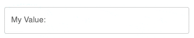

# formik-material

[](https://carlos-algms.github.io/formik-material/)
[](https://codecov.io/gh/carlos-algms/formik-material)
[](https://travis-ci.com/carlos-algms/formik-material)

Material-UI Binds for formik fields

This library exports the `Form`, a `Submit Button`, and many types of fields,
including fields with masks, currency and numeric ones.

## Usage

All the input fields are based on [material-ui fields](https://mui.com/material-ui/react-text-field/),
so all properties and customizations are available.  
Please, refer to the documentation to check all available properties.

### Simple Form example

Rendering a `<Form>` component is required to use any of the fields from this library,
regardless of how deep you put the fields or your abstraction of choice.

```tsx
import { Form, SubmitButton, TextField } from 'formik-material';

function SimpleForm() {
  const initialValues = {
    firstName: 'john',
  };

  return (
    <Form
      initialValues={initialValues}
      onSubmitForm={(values, formikHelpers) => {
        // handle your form submission
        // `values` is TypeScript friendly,
        // and it will match the `initial values` type

        // once your are done, set submitting to false, to allow the user to submit again.
        formikHelpers.setSubmitting(false);
      }}
    >
      <TextField name="firstName" label="First Name:" variant="outlined" />

      <SubmitButton>Submit</SubmitButton>
    </Form>
  );
}
```

The `Form` requires 2 properties `initialValues` and `onSubmitForm`.  
Fields, not present on the `initialValues` won't work properly, so always define the fields names.

The `SubmitButton` component is exposed as a convenience, and is not mandatory,
it will automatically be disabled while the form is in `submitting` state.
**Feel free to use your own submit button**.

### Text field

`TextField` is the base building block for any form, its the same component exposed by material-ui bound to Formik.
Please, refer to [mui docs](https://mui.com/material-ui/react-text-field/) for all possible customizations.

```tsx
import { TextField } from 'formik-material';

// ---

<TextField name="firstName" label="First Name:" />;
```

### Checkbox


```tsx
import { CheckboxField } from 'formik-material';

// ---

<CheckboxField name="read" label="Read and accept our terms" />
<CheckboxField name="accept" label="I accept receiving newsletter" color="secondary" />
```

## Formatted fields / Fields with Mask

These fields leverage the power of the [`react-number-format`](https://www.npmjs.com/package/react-number-format) library.

They accept
[Number format](https://s-yadav.github.io/react-number-format/docs/numeric_format),
[Pattern/Mask format](https://s-yadav.github.io/react-number-format/docs/pattern_format)
on top of all the Mui customizations, giving you the power of both libraries at the same time.

### Currency Field


```tsx
import { CurrencyField } from 'formik-material';

// ---
<CurrencyField name="price" label="Price in Reais:" />;
<CurrencyField prefix="$ " name="price" label="Price in Dollars:" />;
<CurrencyField prefix="¥ " name="price" label="Price in Yens:" />;
```

### Number field



```tsx
import { NumberField } from 'formik-material';

// ---

<NumberField name="age" label="My age:" />;
<NumberField name="count" label="My count:" decimalSeparator="." thousandSeparator="," />;
```

### Formatted field

Formatted field is the low level component, which will accept all properties and customizations,
allowing you to create any type of number, date, or masked inputs.

Again, please refer to
[Number format](https://s-yadav.github.io/react-number-format/docs/numeric_format),
[Pattern/Mask format](https://s-yadav.github.io/react-number-format/docs/pattern_format)
documentation to check all available options.

```tsx
import { FormattedField } from 'formik-material';

// ---

<FormattedField
  name="usaPhoneNumber"
  label="USA phone number"
  type="tel"
  mask="_"
  format="+1 (###) #### ###"
/>;
```

The bellow components are compositions on top of it.

### Brazilian phone field


```tsx
import { BrazilianPhoneField } from 'formik-material';

// ---

<BrazilianPhoneField name="phone" label="My Phone:" />;
```

### CPF field (Brazilian citizen ID)


```tsx
import { CpfField } from 'formik-material';

// ---

<CpfField name="cpf" label="User CPF:" />;
```

### Date Field


```tsx
import { DateField } from 'formik-material';

// ---

<DateField name="birthday" label="My Birthday:" />;
```

### Password field


```tsx
import { PasswordField } from 'formik-material';

// ---

<PasswordField name="password" label="Password:" />;
```
